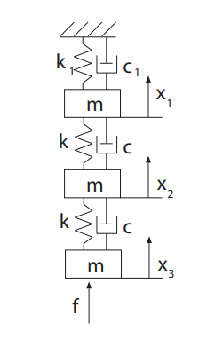

# 3DOF Mass–Spring–Damper Animation

A lightweight Python package to **simulate and animate a 3-DOF mass–spring–damper system** under arbitrary excitation forces (sine, chirp, etc.).
It is designed for educational use and visualization of dynamic systems.

---

## Installation

### Option 1 — From GitHub (recommended during development)

```bash
pip install git+https://github.com/Abdulelah96/3DOF_System.git
```

### Option 2 — Local install (if cloned)

```bash
git clone https://github.com/Abdulelah96/3DOF_System.git
cd 3DOF_System
pip install -e .
```

---

## System Overview

The 3-DOF system consists of **three lumped masses** connected by linear **springs** and **dampers**, as shown below:



---

## Quick Example

```python
from three_dof_anim.animation import make_animation, save_gif
import numpy as np

# Example time vector and displacements
t = np.linspace(0, 10, 201)
x_t = np.vstack([
    0.1 * np.sin(2*np.pi*0.5*t),
    0.05 * np.sin(2*np.pi*0.8*t + 0.3),
    0.08 * np.sin(2*np.pi*1.2*t + 0.1)
]).T

# Create and save the animation
fig, ani = make_animation(t, x_t, speed=2.0)  # Play at 2× speed
save_gif(ani, 'three_dof_demo.gif')
```

## Features

* Build system matrices for a 3DOF mass–spring–damper system
* Define custom excitation forces (sine, chirp, etc.)
* Simulate responses in state-space form
* Animate mass motions with real-time plots of displacement

---

## Requirements

* `numpy`
* `scipy`
* `matplotlib`
* `pillow`

---

## Acknowledgements

This package was developed for the **Bruface Mechanical Vibrations Course** (Academic Year 2025–2026) to support interactive demonstrations and exercises.

Author: **Abdulelah Al-Ghuwaidi**
Affiliation: Vrije Universiteit Brussel (VUB)
[abdulelah.al-ghuwaidi@vub.be](mailto:abdulelah.al-ghuwaidi@vub.be)
